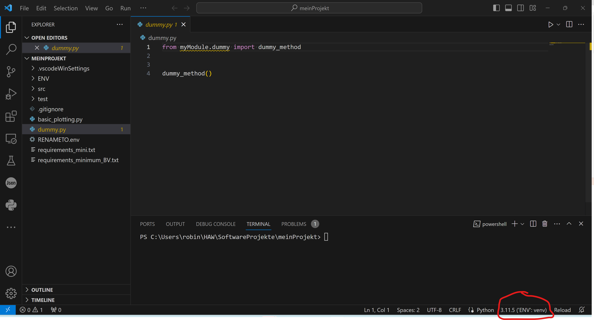

# Einleitung

* Dieses Repo dient zum schnellen einrichten eines Python-Repositories mit VSCODE mit src-Ordnerstruktur

# Anleitung

## Vorbereitung für VSCODE

* Entweder kopieren Sie alle Ordner und Dateien des Repos in Ihren neuen Python-Projekt Ordner (ggf. erst herunterladen)
  * https://github.com/rw-haw/23W-AINF-3a/archive/refs/heads/main.zip
* oder Sie clonen das Repo mit git und löschen danach die Repo-Informationen
  * Bash-Variante mit SSH-Authentifizierung
  ```Bash
  git clone git@github.com:rw-haw/empty-python-vscode.git meinProjekt # Clone des Repos wird im Ordner <meinProjekt> erzeugt
  cd meinProjekt # Wechseln in den Repo Ordner
  rm -rf .git # löscht vorhandenen GIT-conntent
  ```
  * Bash-Variante mit SSH-Authentifizierung
  ```Bash
  git clone https://github.com/rw-haw/empty-python-vscode.git meinProjekt # Clone des Repos wird im Ordner <meinProjekt> erzeugt
  cd meinProjekt # Wechseln in den Repo Ordner
  rm -rf .git # löscht vorhandenen GIT-conntent
  ```

## Projekt mit VSCODE

* Öffen Sie den Ordner *meinProjekt* mit VSCODE

### Aufsetzen einer virtuellen Umgebung

* Ggf. zunächst Python Extensions installieren, z.B. *Python Extension Pack*

#### Powershell

* Bestimmen Sie den absoluten Pfad zu Ihrer Python-Executable, z.B. C:\Python311\python.exe

* Öffnen Sie ein Powershell Terminal in VSCODE und führen Sie folgende Befehle aus (Python Pfad ggf. anpassen)

  ```PowerShell
  C:\Python311\python.exe -m venv ENV
  ```
  

* Öffnen Sie `dummy.py` im Editor
  
  

  * ENV sollte jetzt in der Powershell erkannt werden. Machen Sie ein Relaunch der Powershell oder schließen Sie das Terminal und öffnen ein neues
  
    

  * Verifizieren Sie die ENV im Terminal

    ```PowerShell
    python -c "import sys;print(sys.executable)"
    ```
    Dies sollte den Pfad zu der ENV-Umgebung enthalten.

    

  * Installieren Sie benötigte Python-Pakete in der Umgebung über das Terminal mit dem Paketmanager *pip*

    ```PowerShell
    python -m pip install pytest numpy matplotlib scipy scikit-image
    ```

  * Für Matplotlib-Arbeiten mit dem PyQt-Backend installieren Sie ebenfalls PyQt5 oder PyQt6

    ```PowerShell
    python -m pip install PyQt6
    ```

    * Ggf. benötigen Sie weitere build-Tools. Beachten Sie Hiweise in der Ausgabe bei gescheiterten Installationen des Pakets

#### Python-Dateien

* Öffnen Sie `dummy.py` im Editor
* Selektieren Sie ENV, falls noch nicht automatisch erkannt

  

* Definieren Sie den Ordner *src* als Basis Ordner Ihrer Module, indem Sie *RENAMEMETO.env* umbenennen in *.env* oder verschieben Sie die Datei mit

  ```PowerShell
  mv .\RENAMETO.env .env
  ```
  In der Datei `dummy.py` sollten jetzt das Modul `myModule` auch erkannt werden.

  

### Python Unit-Testing mit pytest

* Wechseln Sie zum Unit-Test Menü von VSCODE (Reagenzglas)

  

* Wählen Sie *Configure Python Tests* aus und wählen Sie dann pytest als Framework aus

  

Und wählen Sie das *root*-directory aus

* Verifizieren Sie, dass es keine Fehler bei der Suche nach Tests gibt:

  

  * Starten Sie einen Test mittels *Play*-Button

    
    

    Grüne Haken zeigen an, dass der Test ohne Fehler ausgeführt wurde.
  
### Run-And-Debug Python-Dateien mit VSCODE einrichten

* Wechseln Sie zum Debug-Menü
  
  

* Wählen Sie *create a launch.json file* und selektieren Sie *Python File*
  
  

* Wechseln Sie auf `dummy.py`, setzen Sie einen Breakpoint und starten Sie den Debugger mit dem *Play*-Button

  
* Es sollte nun möglich sein, Ihr Skript zu debuggen
  
  

  * Es sollte möglich sein in die Funktion `dummy_method` (im Ordner src) hinein zu wechseln:

    

### ENV in interaktiven Python-Skripten und Konsolen

* Öffnen Sie `dummy_interactive.py` und führen Sie die erste Cell aus

  

* ENV sollte automatisch erkannt werden. Installieren Sie das *ipykernel* Paket

  

### ENV in Jupyter-Notebook-Dateien

* Öffnen Sie `dummy.ipynb` und wählen Sie den richtigen Kernel aus

  

* Wählen Sie *Python Environments* und selektieren Sie ENV aus der Liste

  
  

* Verifizieren Sie ENV indem Sie die Cell fehlerfrei ausführen lassen
  


